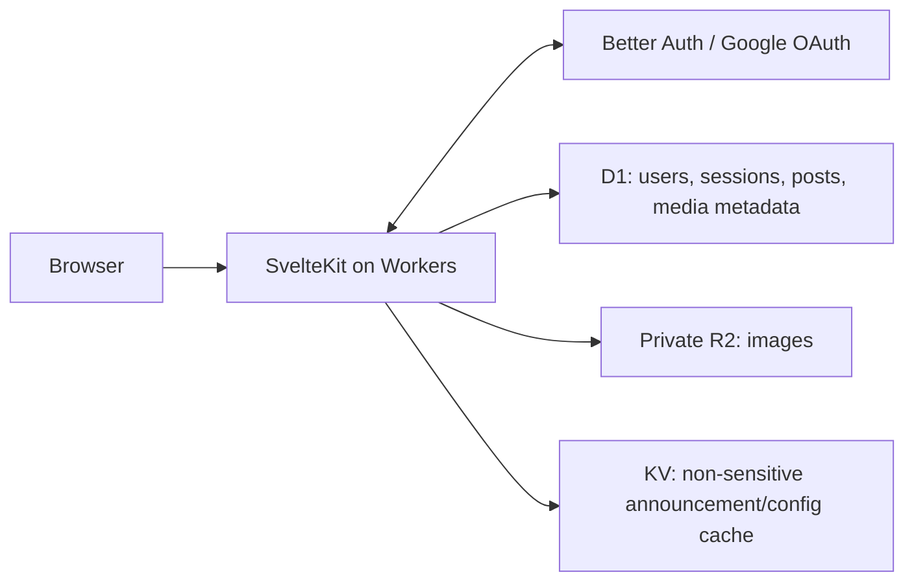

# SNS foundation and delivery plan

Status: everyday journal concept accepted; implementation foundation specified below. Updated September 22, 2026.
Deadline: October 5, 2026. Repository: Japanese-IT-Pathway-Group-5/SNS.

## 1. Product and scope

Build an everyday social journal: a personal blog where ordinary moments are worth sharing. The class is the delivery context, not the subject or long-term audience. Product promise: "Your day doesn't have to be special to be worth sharing." There are 13 days until the deadline; ship the core journey early and reserve the end for verification and the presentation.

Planning default: a small invite-only pilot with one shared audience of approved members, initially classmates. Every post and reply is visible to that audience; show "Shared with pilot members" beside the composer. Do not imply private-diary privacy. Public discovery, followers, and per-post audience selection are later decisions. Team size, availability, budget, branding, and grading rubric remain to be confirmed.

Keep writing fast: a home-page composer, text first, one optional photo, no required title/tags/category, and an optional "Need an idea?" prompt. Encourage posting without streaks, guilt reminders, popularity totals, trending, reposts, or infinite scroll. Use a chronological feed with explicit pagination and a clear end. Posting should remain useful even without replies because entries accumulate in a personal archive.

The shared foundation is defined in [DESIGN_SYSTEM.md](DESIGN_SYSTEM.md), [ENGINEERING.md](ENGINEERING.md), [CONTRIBUTING.md](../CONTRIBUTING.md), and the root [AGENTS.md](../AGENTS.md). These are implementation contracts, not installed tooling.

Required for the first release:

- Google sign-in and sign-out, persistent sessions, and clear unauthorized states.
- Class membership enforcement if class-only access is chosen. Google authentication alone does not establish class membership.
- Chronological, paginated feed, post detail with flat text replies, and an author journal/archive grouped by date. No calendar grid is required for the MVP.
- Create a text post with an optional JPEG, PNG, or WebP image. Proposed limits: 2,000 characters and 5 MiB per image, enforced on the server.
- Edit own post text and delete own posts. Image replacement can follow later.
- Add and delete own replies; moderators may hide replies. Reply access follows the parent post, and hidden/deleted posts must not expose replies.
- Four primary destinations: home/feed, post with replies, personal journal, and settings. Draft text survives submission errors; browser-local draft recovery is user-scoped and cleared on logout, successful publication, or explicit discard. Do not persist images or credentials in local storage.
- Basic moderator ability to hide inappropriate posts, with a recorded reason.
- Responsive, keyboard-accessible UI with loading, empty, validation, and failure states. Verify Japanese text input and rendering; confirm whether Japanese UI copy is required by the class.
- Tested access control, safe upload handling, CI/CD, operating instructions, and a repeatable demo.

After the deadline: follows, private entries/audience controls, search, notifications, multiple images, richer profiles, and account self-service. Defer video, chat, algorithmic feeds, and microservices. If the rubric requires any of these, revise scope before implementation.

Data science direction: evaluate opt-in semantic search over a member's own memories, comparing keyword retrieval with multilingual embeddings on a permissioned, held-out dataset. ML is a post-MVP experiment, not a release dependency. Do not send journal content to model providers or train on it without an explicit data-use decision and consent. Deletions and access restrictions must propagate to any future search index.

Product validation: invite a few pilot members to publish a small daily moment without coaching. Observe hesitation, composer-to-publication time, failed submissions, and whether they return voluntarily. Ask whether the entry felt too small for their usual social apps. These are hypotheses to test, not promises of increased engagement; collect no private draft text in analytics.

## 2. Architecture

Visual direction: a cozy journal inspired by the user's "Don't Wake Roko" reference, using pale mint, warm cream, muted teal, peach and soft lime. Keep text and controls readable, with original pixel-art accents for loading, empty and success states. Use one shared sprite system with short loops, still/reduced-motion fallbacks and no artificial waiting. Prioritize one pending animation and one empty-state still for the MVP; mascot design remains open. The full palette and art contracts live in [DESIGN_SYSTEM.md](DESIGN_SYSTEM.md).

Use a single SvelteKit application with TypeScript, deployed to Cloudflare Workers with the Cloudflare adapter. Keep server responsibilities in separate modules within that application.



| Component              | Proposed choice                                   | Purpose                                                                                  |
| ---------------------- | ------------------------------------------------- | ---------------------------------------------------------------------------------------- |
| Web application        | SvelteKit + TypeScript                            | UI, server rendering, actions, endpoints                                                 |
| Styling and components | Tailwind CSS + shared Svelte components + Bits UI | Token-based styling and consistent interactive behavior                                  |
| Icons                  | Lucide for Svelte                                 | One consistent, selectively imported icon family                                         |
| Authentication         | Better Auth + Google                              | OAuth and session management                                                             |
| Database               | Cloudflare D1 + Drizzle                           | Relational data, constraints, checked-in migrations                                      |
| Object storage         | Cloudflare R2                                     | Uploaded image bytes                                                                     |
| Key-value storage      | Cloudflare KV                                     | Infrequently changed, non-sensitive class announcement/configuration with a safe default |
| Validation             | Zod                                               | Shared input shapes, authoritative server validation                                     |
| Quality                | ESLint, Prettier, svelte-check                    | Consistency and framework/type checks                                                    |
| Tests                  | Vitest + Playwright                               | Logic/integration tests and browser journeys                                             |
| Dependency protection  | Safe Chain + pnpm audit                           | Malware screening during installation and known-vulnerability checks                     |
| Review                 | Human review + CodeRabbit + SonarQube Cloud       | Complementary review and analysis                                                        |
| Delivery               | GitHub Actions + Wrangler                         | Repeatable checks and deployment                                                         |

KV is eventually consistent. Keep sessions, membership, permissions, posts, and exact quotas out of KV. Do not use KV as the primary database or a security-critical counter. Its proposed announcement/configuration use must tolerate stale values. [Cloudflare KV consistency](https://developers.cloudflare.com/kv/concepts/how-kv-works/)

The selected integrations are documented independently; validate the exact combined versions and D1 adapter behavior in an early deployed experiment. Pin versions after that succeeds. [SvelteKit on Workers](https://developers.cloudflare.com/workers/framework-guides/web-apps/sveltekit/), [Better Auth SvelteKit integration](https://better-auth.com/docs/integrations/svelte-kit), [Better Auth Drizzle adapter](https://better-auth.com/docs/adapters/drizzle), [Drizzle D1](https://orm.drizzle.team/docs/sqlite/connect-cloudflare-d1)

Proposed code boundaries:

```text
src/lib/components/          shared UI
src/lib/validation/          input schemas
src/lib/server/auth/         authentication and membership
src/lib/server/db/           schema and queries
src/lib/server/posts/        post operations and authorization
src/lib/server/storage/      R2 operations and image validation
src/routes/                 pages, thin actions and endpoints
tests/                      integration and browser tests
drizzle/                    reviewed SQL migrations
docs/                       architecture, setup and operations
.github/                    workflows and issue/PR templates
```

Start with Better Auth's generated tables, plus `memberships`, `posts`, `replies`, `media`, and `moderation_events`. Reference the authenticated user ID for ownership, use foreign keys and indexes for the feed, and store object keys in media rows rather than image bytes. Keep membership and moderator roles server-controlled. Do not expose emails in profile responses. Replies reference posts and inherit their visibility.

Use one migration process: generate/review SQL, check it in, and apply through a documented D1 deployment step. Avoid two independent tools mutating the live schema. Test the actual D1 behavior required by the auth adapter, particularly any transaction assumptions.

## 3. Security and upload design

Security is application behavior as well as tooling. Minimum release conditions:

- Every protected read/write validates the session on the server. Every edit/delete verifies ownership or moderator permission. Ignore client-supplied author IDs and roles.
- For class-only access, validate verified Google identity against a server-managed member list. Deny unknown users. Apply the same access rules to image delivery.
- Configure exact OAuth callback URLs for local, staging, and production environments; use a stable staging hostname. Keep secrets server-side. Better Auth documents the callback setup [here](https://better-auth.com/docs/authentication/google).
- Preserve framework/auth origin and CSRF defenses; protect custom upload endpoints too. Use secure cookies in production and verify logout/expired sessions deny subsequent access. Avoid introducing stale session caches initially.
- Render posts as escaped plain text. Validate all inputs server-side and use parameterized database access. Add a tested Content Security Policy and appropriate response headers.
- Rate-limit login attempts, post creation, and uploads. Cloudflare's rate-limit binding is a useful abuse control, but its counters are approximate and local to a Cloudflare location; exact storage quotas require authoritative database checks. [Rate-limit behavior](https://developers.cloudflare.com/workers/runtime-apis/bindings/rate-limit/)
- Keep credentials, sessions, tokens, and private post contents out of logs and CI artifacts. Set retention and access rules for logs and uploaded content.

For the MVP, send the small image through an authenticated server endpoint into private R2. Check actual bytes received, allowed format/signature, and image dimensions; do not trust filename or browser MIME type. Generate object keys, prohibit SVG/HTML and arbitrary files, serve validated content with the correct type and `nosniff`, and require membership when serving private images. Where supported within the runtime budget, decode/re-encode to strip metadata and reject malformed images; verify the processing approach early. [OWASP upload guidance](https://cheatsheetseries.owasp.org/cheatsheets/File_Upload_Cheat_Sheet.html), [R2 Workers API](https://developers.cloudflare.com/r2/get-started/workers-api/)

D1 and R2 do not share an application transaction. Track pending/ready media state: publish only after storage succeeds; remove the new object if the database write fails; make cleanup retryable. Deleting/hiding a post must immediately deny application access to its media, even if physical cleanup needs a retry. Test failed upload and failed cleanup paths.

Before a wider public launch, expand moderation/reporting, account deletion, abuse controls, and storage quotas. For the class release, assign a contact and a documented manual process for content/account removal.

## 4. Organization and development workflow

Use GitHub Flow: issue -> short feature branch -> draft PR -> automated checks and review -> squash merge into `main` -> staging -> production release. A separate long-lived `develop` branch is unnecessary for this scope; use environments for staging and production.

- Keep `main` releasable. Branch names: `feat/123-google-login`, `fix/124-upload-limit`, or `chore/125-ci`.
- Require one human approval from someone other than the author, passing required checks, and resolved review conversations. Block direct pushes, force pushes, and deletion of `main`; dismiss stale approvals on substantive updates.
- Confirm the organization's GitHub plan and repository visibility before promising enforcement: protected branches for private organization repositories depend on plan availability. [GitHub branch protection](https://docs.github.com/en/repositories/configuring-branches-and-merges-in-your-repository/managing-protected-branches/about-protected-branches)
- Use CODEOWNERS for auth/security, database migrations, and deployment workflows. Assign a primary owner and backup for each area; avoid a single reviewer becoming a bottleneck.
- Keep PRs focused on one outcome, with the linked issue, behavior change, verification evidence, UI screenshots where useful, and migration/security implications.
- Configure CodeRabbit for project conventions, server authorization, safe uploads, and migration risks; generated files need different review treatment. A teammate still decides whether suggestions are valid. [CodeRabbit setup](https://docs.coderabbit.ai/getting-started/quickstart)
- Track work in a GitHub Project: Backlog, Ready, In progress, In review, Done. Each issue needs acceptance criteria, priority, owner, and dependencies. Use a short daily update: completed, next, blockers.
- Keep Cloudflare, Google OAuth, and GitHub resources under team-controlled ownership, with two maintainers and individually granted access. Do not share passwords or store credentials in chat.

Suggested work areas, combined as needed for team size: foundation/release, auth/security, posts/storage, and UI/testing/demo. Everyone writes verification for their own feature and reviews a teammate's work.

## 5. Checks and deployment

Pin the Node and pnpm versions, commit the lockfile, use frozen installs in CI, and review dependency lifecycle scripts. Install Safe Chain before project dependencies on laptops and CI; use its documented CI mode and verify interception. It screens installs for malware; `pnpm audit` checks reported vulnerabilities. Neither validates application authorization. [Safe Chain](https://github.com/AikidoSec/safe-chain), [pnpm audit](https://pnpm.io/cli/audit)

Proposed local hooks: staged formatting/linting on pre-commit; `pnpm audit --audit-level=high`, type checks, and fast tests on pre-push. Hooks can be skipped, so enforce the equivalent checks in CI. Record any narrowly scoped audit exception with its advisory, rationale, owner, and expiry; do not silently ignore audit outages or failures.

Required PR pipeline:

1. Pinned tool setup, Safe Chain verification, frozen dependency install.
2. Formatting, ESLint with Svelte rules, svelte-check, and dependency/secret checks.
3. Vitest logic/integration tests, migration tests against local D1, and production build.
4. Playwright critical journeys against a production-like local Workers runtime with isolated test data.
5. SonarQube analysis for supported files, plus CodeRabbit and human review.

Confirm SonarQube Cloud plan eligibility and PR-analysis behavior during setup. Do not assume `.svelte` files receive complete analysis: a Sonar staff response in May 2026 reported no known plans for Svelte support. Keep ESLint and svelte-check required regardless. Set a realistic new-code quality gate after inspecting the initial scan. [Sonar plans](https://docs.sonarsource.com/sonarqube-cloud/administering-sonarcloud/managing-subscription/subscription-plans), [Svelte support discussion](https://community.sonarsource.com/t/support-for-svelte/182326)

Run untrusted PR checks without deployment credentials. Pin third-party actions to reviewed commit SHAs, minimize token permissions, and do not execute PR code in a privileged workflow. Give CI only the environment-specific Cloudflare permissions it needs.

Deploy checked `main` commits to staging automatically. After staging smoke checks, release the same selected commit to production via a controlled Actions workflow, with a maintainer responsible for the release. Serialize deployments per environment. Never expose production data or secrets to previews. Start with one stable staging environment instead of per-PR infrastructure.

Use separate D1 databases, R2 buckets, KV namespaces, auth secrets, and OAuth configuration for staging and production. Apply backwards-compatible migrations before deploying dependent code. Record deployed commit and migration versions. Test a database restore and application rollback procedure; rolling back code alone does not undo schema or data changes.

Add dependency update automation, secret scanning, structured error logs, a basic health check, and budget/usage alerts. Choose one dependency-update bot. Extra monitoring services can wait if Cloudflare logs provide enough visibility for the class release.

## 6. Delivery schedule

| Dates (2026) | Outcome                                                      | Exit condition                                                                                                              |
| ------------ | ------------------------------------------------------------ | --------------------------------------------------------------------------------------------------------------------------- |
| Sep 22-23    | Scope, shared UI foundation, scaffold, CI, environment setup | Token stylesheet, core components, component showcase, and example form reviewed; clean clone works; staging shell deployed |
| Sep 24-25    | Authentication and database integration                      | Real Google login/logout works on staging; membership and unauthorized cases verified                                       |
| Sep 26-28    | Complete posting journey                                     | Login -> create text/image post -> feed -> reply -> journal -> edit/delete; failure cleanup works                           |
| Sep 29-30    | UI and security completion                                   | Mobile and Japanese text verified; authorization/upload negative tests pass                                                 |
| Oct 1-2      | Release candidate and operating checks                       | Staging acceptance passes; restore/rollback documented and rehearsed; feature freeze                                        |
| Oct 3-4      | Buffer, production verification, demo practice               | Release deployed; demo accounts and fallback recording ready                                                                |
| Oct 5        | Submission/demo                                              | Tagged release, setup guide, architecture explanation, test evidence and known limits                                       |

If core integration slips, drop optional UI enhancements and all social extras first. Preserve login, posting/upload, security, and deployment. The critical dependency is an early successful SvelteKit + Better Auth + D1 deployment; do not leave it until the end.

## 7. Acceptance and first backlog

Release checks must prove: two distinct users cannot edit/delete each other's posts; nonmembers cannot read private posts/images; logout and expired sessions block access; valid uploads succeed; oversized, malformed and disallowed files fail; script-like post text remains inert; failed storage/database operations do not create visible broken posts; feed pagination works; migrations apply to a clean database; and the production build runs in Workers.

Use deterministic test users/sessions confined to isolated test environments for automated browser tests, with no production test-login backdoor. Separately test real Google OAuth manually on stable staging and production; external Google login should not make every CI run fragile.

Initial issues, in dependency order:

1. Confirm rubric, team capacity, visibility, upload scope and spending limit.
2. Scaffold SvelteKit, pin tools, implement design tokens/core components and a development-only showcase, and write clean-clone setup instructions. Review the reference composer/post card and pixel loading fallback before distributing UI work. Track original mascot/art creation separately; start with one pending sprite and one empty-journal still.
3. Set up CI, hooks, PR templates, review ownership and branch rules.
4. Provision isolated staging resources and Google OAuth configuration.
5. Prove Better Auth + D1 login/session/membership behavior on staging.
6. Implement migrations, post model, authorization and feed queries.
7. Implement private R2 uploads, validation and failure cleanup.
8. Complete composer, feed, replies, journal/archive and settings UI, including draft recovery and error states.
9. Add moderator controls, rate limiting, headers and negative tests.
10. Configure review scanners, logs, dependency updates and secret checks.
11. Verify release/restore procedures and prepare the class demo.

Every issue is done when its acceptance criteria pass, another teammate reviews it, CI passes, and its documentation/environment implications are recorded. Confirm feature behavior on staging before closing release-critical work.

## 8. Open decisions

- Team size, experience and available hours through October 5.
- Confirm text plus one image meets the rubric; files/video are outside the accepted product scope.
- Confirm invite-only pilot versus public launch; who maintains membership and moderation?
- GitHub public/private repository and organization subscription.
- Hosting budget, domain, Google OAuth project owner, and Cloudflare owner.
- Exact rubric and Japanese UI/presentation requirements.

Foundation specifications are recorded in the linked documents. App code, infrastructure, protection rules, scanners, and workflows are not configured yet. Product naming and visual direction can be refined centrally without changing the everyday-journal concept.
